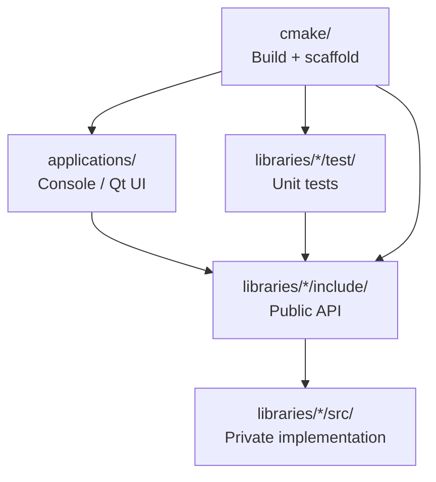

# Architecture

UnitPro follows Clean Architecture principles adapted for C++ libraries and CMake.

## Goals

- **Reusable template** — clone and start a sandbox or product library quickly
- **Clear boundaries** — public API vs private implementation vs applications
- **Testability** — every library ships with GoogleTest by default
- **Reproducibility** — pinned dependencies, CMake presets, CI parity

## Layer diagram

| Layer | Path | Responsibility |
|-------|------|----------------|
| Applications | `applications/` | Entry points; depend only on public library targets |
| Public API | `libraries/*/include/` | Stable headers, export macros, namespaces |
| Implementation | `libraries/*/src/` | Private logic (`*_impl`); not installed as public API |
| Tests | `libraries/*/test/` | Unit tests against the public API |
| Build system | `cmake/` | Targets, warnings, coverage, install, scaffolding |

## SOLID mapping

| Principle | How UnitPro applies it |
|-----------|------------------------|
| **S**ingle Responsibility | One library folder = one bounded component; apps only orchestrate |
| **O**pen/Closed | Extend via new libraries in `UNITPRO_LIBRARIES`, not by editing Core |
| **L**iskov | CMake aliases (`UnitPro::Core`) keep consumer contracts stable |
| **I**nterface Segregation | Thin public headers; heavy details stay in `*_impl` |
| **D**ependency Inversion | Apps and tests depend on the public API, not on private sources |

## DRY / KISS / SoC

- **DRY** — `create_library` / `create_application` centralize target wiring
- **KISS** — committed `Core` sample is minimal (`get_the_answer`, `multiply`)
- **Separation of Concerns** — generation (`LibraryGenerator`) is separate from compilation (`BuildUtils`)

## CMake module map

| Module | Role |
|--------|------|
| `cmake/Common.cmake` | Standards, module includes, testing/Qt toggles |
| `cmake/BuildUtils.cmake` | `create_library`, `create_application` |
| `cmake/modules/LibraryGenerator.cmake` | Scaffold from `cmake/template/` |
| `cmake/modules/CompilerWarnings.cmake` | Strict warnings as errors |
| `cmake/modules/Coverage.cmake` | gcov / lcov target |
| `cmake/modules/InstallConfig.cmake` | `find_package(UnitPro)` export |
| `cmake/GTestSupport.cmake` | Pinned GoogleTest via FetchContent |
| `cmake/TestUtils.cmake` | `build_gtest_executable` |

## Naming conventions

| Kind | Pattern | Example |
|------|---------|---------|
| CMake alias | `UnitPro::<Lib>` | `UnitPro::Core` |
| Raw target | lowercase with `_` | `unitpro_core` |
| Test executable | `test_<raw>` | `test_unitpro_core` |
| Export header | `UnitPro_<Lib>_export.h` | generated in build tree |
| Namespaces | `UnitPro::<Lib>` | `UnitPro::Core::multiply` |

## Dependency rules

1. `applications/` may depend on `UnitPro::*` libraries.
2. Libraries may depend on other `UnitPro::*` libraries only through **public** or **private** CMake dependency lists — never by including another library’s `src/`.
3. Tests link the library under test + GoogleTest; they must not include `*_impl` headers unless testing internals on purpose.
4. Third-party packages are introduced via `find_package` / FetchContent with **pinned** versions.

## Why generate-on-configure still exists

`GENERATE_SCAFFOLD` creates missing libraries from templates so adding a component is one list edit. The default `Core` library is **committed** so CI and clones work without relying on generation side effects.

## Out of scope (intentionally)

- Full application framework / DI container
- Package manager lockfiles for system Qt installs
- Cross-compilation toolchains (add via your own CMake toolchain file)
